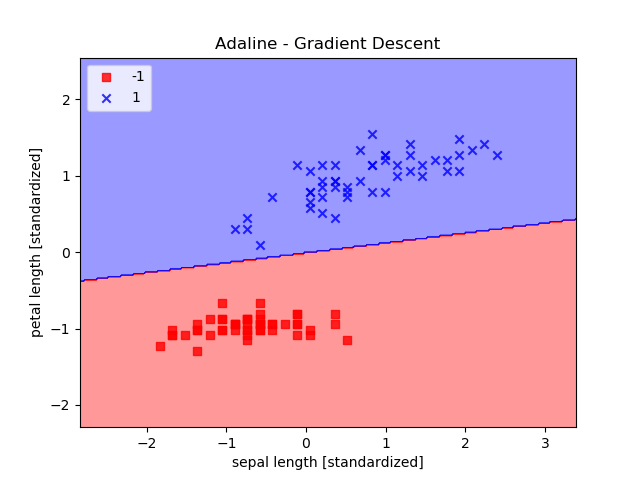
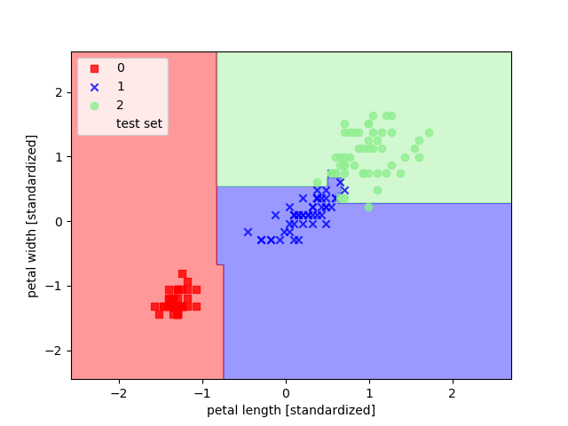
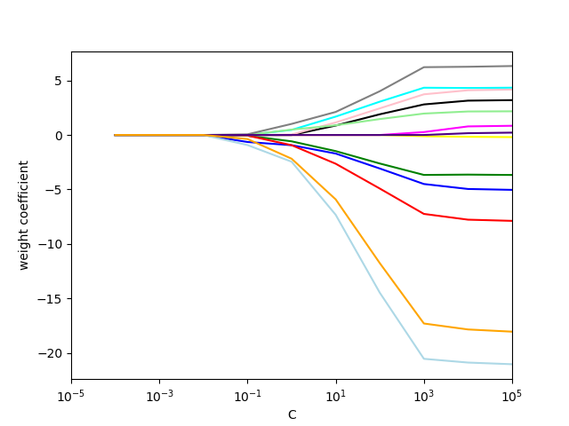
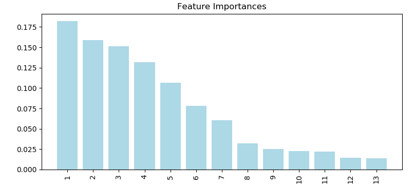

[TOC]

# 第一章 赋予计算机学习数据n能力

机器学习提供了一种从数据中获取知识的方法，同时能够逐步提高预测模型的性能，并将模型应用于基于数据驱动的决策中去。

### 机器学习的三种方法

- 监督学习 supervised learning

  使用有类标(label)的训练数据来构建模型，使用该模型对未来数据进行预测。

  监督 supervised：指训练数据集中的每个样本均有一个已知的输出项。

  - 分类 classification

    这里的类标是离散的、无序的值

  - 回归 regression

    对连续型输出变量进行预测

- 无监督学习 unsupervised learning

  聚类：在没有先验信息的情况下，将数据划分为有意义的小的组别(cluster)

  降维(dimensionality reduction)：在最大程度保留相关信息的情况下将数据压缩到一个维度较小的子空间。

- 强化学习 reinforcement learning

  构建一个系统(agent)，在与环境交互过程中提高系统的性能。

  环境 environment：其当前状态信息中包含一个反馈信号。

### 构建机器学习的步骤

- 数据预处理
- 选择预测模型类型
- 训练模型并验证模型
- 对未知数据进行预测

### Python在机器学习中的包

- pip

  `pip install package`

  `pip install package --upgrade`

- anaconda

  `export PATH=/home/yule/anaconda3/bin:$PATH`

  `conda install package`

  `conda update package`

# 第二章 机器学习分类算法

早期算法：感知器(perceptron)  , 自适应线性神经元(adaptive linear neuron)

### 人造神经元 perceptron

- 神经细胞（MCP神经元模型）

  树突接收多个输入信号，如果累加的信号超过某一阈值，经细胞体的整合就会生成一个二进制输出信号，并通过轴突传递。

- 第一个感知器学习法则：自学习算法

  - 特定的输入值x
    $$
    \mathbf{x} =  \begin{vmatrix} 
    x_1 \\
     ... \\
     x_m\\
    \end{vmatrix}
    $$

  - 相应的权値向量w
    $$
    \mathbf{w} =  \begin{vmatrix} 
    w_1 \\
     ... \\
     w_m\\
    \end{vmatrix}
    $$

  - 净输入z
    $$
    z=w_1x_1+ \ ...\ +w_mx_m\\
    z=w^Tx
    $$

  - 激励函数activation function$\phi(z)$
    $$
    \phi(z)=
    \begin{cases}
    1& z\ge\theta\\
    -1& otherwise\\
    \end{cases}\\
    \theta:阈值
    $$

  - 自学习算法的步骤

    1. 将权重初始化为零

    2. 迭代所有训练样本$x^{(i)}$,计算出输出值$\hat y=\phi(w^Tx)$

    3. 更新权重

        $\Delta w_j=\eta (y^{(i)}-\hat{y}^{(i)})x^{(i)}_j$		$\eta$：学习速率

       $w_j:=w_j+\Delta w_j$

    注：该感知器手链的前提是两个类别必须线性可分

- Python实现感知器

  见：[2.2感知器学习算法.py](./Python机器学习-代码/2.2感知器学习算法.py)

得到结果如下：

### 自适应线性神经元 Adaline

这也是一种单层神经网络：Adaptive Linear Neuron, Adaline

- 通过梯度下降最小化代价函数

  算法核心：

  1. 定义一个目标函数$$ J(w)$$（代价函数），其最小化处理

     Adaline中：J = SSE(Sum of Squared Error,误差平方和)

  $$
  J(w)=\frac{1}{2}\sum_i(y^{(i)}-\phi(z^{(i)}))^2权重
  $$
   (前面1/2的系数是为了后面求导方便)
  2. 权重增量：负梯度和学习速率$\eta$的乘积
     $$
     \Delta w=-\eta\Delta J(w) \\
     \Delta w_j=-\eta\frac{\partial J}{\partial w_i}=\eta \sum_i (y^{(i)}-\phi(z^{(i)}))x_j^{(i)}
     $$

  3. 沿着梯度方向做一次权重更新
     $$
     w:=w+\Delta w
     $$

- 使用python实现自适应线性神经元

  见：[2.3自适应线性神经元.py](./Python机器学习-代码/2.3自适应线性神经元.py)

- 当执行注释部分的代码：分别绘制在两个不同的学习速率下，代价函数与迭代次数的图像

    

  - 执行注释后面部分的代码：

    所有样本都被正确分类，但是误差平方和SSE的值仍不为零。（为什么？）

    

    

- 大规模机器学习与随机梯度下降

  - 替代批量梯度下降的算法：（三个名字同一个东西）
    1. 随机梯度下降：stochastic gradient descent
    2. 迭代梯度下降：iterative gradient descent
    3. 在线梯度下降：on-line gradient descent

  - python实现

    见：[2.3随机梯度下降.py](./Python机器学习-代码/2.3随机梯度下降.py)

    结果可以看出，代价函数的均值下降很快

    

    

# 第三章 使用scikit-learn实现机器学习分类算法

- 训练机器学习算法的步骤：
  1. 特征的选择
  2. 确定性能评价指标
  3. 选择分类器和优化算法
  4. 对模型性能的评估
  5. 算法的 调优

### scikit-learn的使用

见：[3.2使用scikit-learn训练感知器](./Python机器学习-代码/3.2使用scikit-learn训练感知器.py)

结果如图：无法完全线性可分

### 逻辑斯谛回归中的类别概率

- 逻辑斯谛回归与条件概率

  - 几率比 (odd ratio)
    $$
    \frac{p}{1-p}   \ \ \ \ \ \ \ \ \ p：正事件发生的概率
    $$

  - logit函数(log-odds,对数几率)
    $$
    logit(p)=log\frac{p}{1-p}
    $$

  - 条件概率，在给定特征x的条件下，某一个样本属于类别1的条件概率：
    $$
    p(y=1|x)
    $$

  - 对数几率：输入特征值的线性表达式
    $$
    logit(p(y=1|x))=w0x0+w1x1+...+w_mx_m=\Sigma_{i=0}^{m}w_ix_i=w^Tx
    $$

  - logistic函数(logit函数的反函数)/sigmoid函数 ( =p )
    $$
    \phi(z)=\frac{1}{1+e^{-z}}
    $$

  - 净输入z，是样本特征和权重的线性组合 ( =logit() )
    $$
    z=w^Tx=w0x0+w1x1+...+w_mx_m
    $$

  sigmoid函数图像如下：

  

- 通过逻辑斯谛回归模型的代价函数获得权重

  - 最大似然函数**L**
    $$
    L(w)=P(y|x;w)=\Pi_{i=1}^{n}P(y^{(i)}|x^{(i)};w)=(\phi(z^{(i)}))^{y^{(i)}}(1-\phi(z^{(i)}))^{1-y^{(i)}}
    $$
    （在本问题中y可取1或0，从而使得第二项或第一项等于1，得到此时单个的概率）

  - 对数似然函数
    $$
    l(w)=logL(w)=\Sigma_i^n \ y^{(i)}log(\phi(z^{(i)}))+(1-y^{(i)})log(q-\phi(z^{(i)}))
    $$

  - 代价函数

  $$
  J(w)=\Sigma_{i=1}^n -log(\phi(z^{(i)}))-(1-y^{(i)})log(1-\phi(z^{(i)}))
  $$

    - 计算**单个**样本实例的成本

  $$
  J(\phi(z),y;w)=-ylog(\phi(z))-(1-y)log(1-\phi(z))
  $$

  ​	进而可得
  $$
  J(\phi(z),y;w)=
  \begin{cases}
  -log(\phi(z)) & if\ y=1\\
  -log(1-\phi(z)) & if\ y=0\\
  \end{cases}\\
  $$
  ​	图像为：

  ​	如果样本正确划分到类别1中，代价将趋于0（蓝线）。

  ​	如果分类错误，代价将趋于无穷。

  - 逻辑斯谛回归中的梯度下降
    $$
    \frac{\partial}{\partial w_j}l(w)=(y\frac{1}{\phi(z)}-(1-y)\frac{1}{1-\phi(z)})\frac{\partial}{\partial w_j}\phi(z)
    $$

    $$
    化简有：\ \ \frac{\partial}{\partial w_j}l(w)=(y-\phi(z))x_j
    $$

    进而更新权重：
    $$
    w_j := w_j + \eta\Sigma_{i=1}^n (y^{(i)}-\phi(z^{(i)}))x^{(i)}
    $$
    $$
    w:=w+\Delta w
    $$

    $$
    \Delta w=-\eta \bigtriangledown J(w) 
    $$

- 使用scikit-learn训练逻辑斯谛回归模型

  代码见：[3.3使用scikit-learn训练逻辑斯谛回归模型](./Python机器学习-代码/3.3使用scikit-learn训练逻辑斯谛回归模型.py)

  得到结果：

- 通过正则化解决过拟合问题

  - 偏差-方差衡量(bias-variance tradeoff)：

    通过正则化调整模型的复杂度

  - 正则化：

    解决共线性问题，可以过滤掉数据中的噪声，防止过拟合

    - 原理：

      引入额外的偏差，对极端参数权重做出惩罚

    - L2正则化
      $$
      \frac{\lambda}{2}||w||^2=\frac{\lambda}{2}\Sigma_{j=1}^mw_j^2
      $$
      其中$$\lambda$$是正则化系数

    - 在逻辑斯谛回归中加入正则化项
      $$
      J(w)=\{\Sigma_{i=1}^n -log(\phi(z^{(i)}))-(1-y^{(i)})log(1-\phi(z^{(i)})) \}+\frac{\lambda}{2}||w||^2
      $$
      增加$$\lambda$$可以增强正则化的强度

### 使用SVM最大化分类间隔

感知器：最小化分类误差

SVM：最大化分类间隔。间隔（两个分离的超平面间的距离）。超平面（决策边界）

支持向量：最靠近超平面的训练样本

- 使用松弛变量解决分线性可分问题

  - 松弛系数$$\xi$$

    对于非线性可分的数据，需要放松线性约束条件，以保证在适当的罚项成本下，对错误分类的情况进行优化时能够收敛。

  - 训练一个SVM模型

    代码见：[3.4训练一个线性SVM模型](./Python机器学习-代码/3.4训练一个线性SVM模型.py)

    得到结果：

- 使用scikit-learn实现SVM

  数据集非常大的时候，scikit-learn提供了SGDClassifier类。

### 使用核SVM解决非线性问题

- 基本理念

  通过映射函数$\phi()$将样本的原始特征映射到一个使样本线性可分的更高维空间中

- 核函数
  $$
  k(x^{(i)},x^{(j)})=\phi(x^{(i)})^T\phi(x^{(j)})
  $$
  例如：径向基函数核(RBF kernel) / 高斯核(Gaussian kernel)
  $$
  k(x^{(i)},x^{(j)})=exp(-\gamma||x^{(i)}-x^{(j)}||^2)
  $$
  ​	待优化的自有参数
  $$
  \gamma=f\frac{1}{2\sigma^2}
  $$
  核：一对样本之间的相似函数。当完全相同时，值为1；当差异巨大时，值趋于0

- 分离超平面demo

  代码见：[3.5使用核SVM解决非线性问题](./Python机器学习-代码/3.5使用核SVM解决非线性问题.py)

  得到结果：

- 分离超平面处理鸢尾花数据

  参数中的$$\gamma$$ (gamma)可以理解为高斯球面的截止参数

  如果增加$$\gamma$$，就会减小i受影响的训练样本的范围，导致决策边界更严格。

  代码见：[3.5使用核技巧在高维空间发现分离超平面](./Python机器学习-代码/3.5使用核技巧在高维空间发现分离超平面.py)

  当gamma分别去0.2和100时，得到结果如下

  

  

  图2就过拟合了，对未知数据有一个较高的泛化误差

### 决策树

- 最大化信息增益

  - 决策树基本理念

    基于训练数据集的特征，决策树通过一系列的问题来推断样本的类标

    算法：从树根开始，基于最大信息增益(IG,information gain)的特征来对数据进行划分。

    解决过拟合问题：对树进行剪枝来限定树的最大深度。

  - 目标函数：对信息增益最大化
    $$
    IG(D_p,f)=I(D_p)-\Sigma_{j=1}^{m}\frac{N_j}{N_p}I(D_j)
    $$
    信息增益：父节点不纯度 与 所有子节点不纯度总和 之差。

    子节点的不纯度越低：信息增益越大，这样越好。

    ​	$D_p$:父节点

    ​	$$D_j$$：第j个子节点

    ​	$$N_p$$：父节点中样本的数量	

    ​	$$N_j$$：第j个子节点中样本的数量

    ​	$$f$$：要进行划分的特征

    ​	$$I$$：不纯度衡量标准

  - 不纯度衡量标准

    - 熵$$I_H$$(entropy)
      $$
      I_H(D)=-\Sigma _{i=1}^cp(i|D)log_2p(i|D)
      $$
      ​	$$p(i|D)$$：特定节点D中，属于类别c的样本占节点D中样本总数的比例zuidazuida

      ​	当所有样本都属于同一类别，熵为0；

      ​	当样本以相同的比例分属于不同的类，熵最大。

      ​	所以熵的准则是使得互信息最大化。

    - 基尼系数$$I_G$$(gini index)
      $$
      I_G(D)=1-\Sigma _{i=1}^cp(i|D)^2
      $$
      基尼系数可以理解为降低误分类可能性的标准

    - 误分类率$$I_E$$(classification error)
      $$
      I_E=1-max\{p(i|D)\}
      $$
      对于剪枝很有用。

    我们希望：不纯度越低越好，纯度就高，说明样本分离的好，这样目标函数IG就很大。也就说明从父节点到子节点，不纯度变化大，分的有效果。

- 构建决策树

  代码见：[3.6构建决策树](./Python机器学习-代码/3.6构建决策树.py)

  结果：

  

  使用GraphViz程序可以进行可视化处理，得到结果：

  

- 通过随机森林将弱分类器集成为强分类器

  随机森林：多棵决策树的集成

  步骤：

  1. 使用bootstrap抽样方法随机选择n个样本用于训练
  2. 使用步骤1的样本构造一棵决策树：不重复地随机选择d个特征
  3. 重复步骤1和2过程很多次
  4. 汇总每棵决策树的类标进行多数投票

  代码见：[3.6通过随机森林将弱分类器集成为强分类器.py](./Python机器学习-代码/3.6通过随机森林将弱分类器集成为强分类器.py)

  结果：

  

### k-近邻算法(KNN)

- 闵可夫斯基距离
  $$
  d(x^{(i)},x^{(j)})=p\sqrt{\Sigma_k|x_k^{(i)}x_k^{(j)}|^2}
  $$
  该距离是对欧几里得距离及曼哈顿距离的一种泛化。

  p=1:曼哈顿距离

  p=2:欧几里得距离

# 第四章  数据预处理-构建好的训练数据集

### 缺失数据的处理

- 删除存在缺失值的特征

  使用df.dropna()

- 填充缺失数据

  Impute类可以实现均值插补

- 数据转换常用的两个方法

  fit方法：对数据集里的参数进行识别，并构建相应的数据补齐模型

  transform方法：用刚构建的模型对相应参数的缺失值进行补齐。

代码见：[4.1处理缺失数据](./Python机器学习-代码/4.1处理缺失数据.py)

### 处理类别数据

- 数据的分类

  - 数值型数据
  - 类别数据
    - 标称特征：如衣服的颜色(红,黄,蓝)
    - 有序特征：如衣服的尺寸(XK>L>M)

- 独热编码

  创建一个新的虚拟特征，虚拟特征的每一列各代表标称数据的一个值

  代码见：[4.2处理类别数据](./Python机器学习-代码/4.2处理类别数据.py)

### 将特征的值缩放到相同的区间

- 特征缩放

  - 归一化(normalization)

    将特征的值缩放到区间[0,1]
    $$
    x_{norm}^{(i)}=\frac{x^{(i)}-x_{min}}{x_{max}-x_{min}}
    $$

  - 标准化(standardization)

    将特征值的均值设为0，方差为1.特征列变为标准正态分布。
    $$
    x_{std}^{(i)}=\frac{x^{(i)}-\mu _x}{\sigma _x}
    $$
    式中变量是均值和标准差。

  代码见：[4.3葡萄酒数据集.py](./Python机器学习-代码/4.3葡萄酒数据集.py)

### 选择有意义的特征

- 解决过拟合的问题的两种方法
  - 正则化引入罚项：对小的权重做出激励
  - 特征选择降维

- 使用L1正则化实现数据稀疏化
  $$
  L1 : ||w||_1=\Sigma_{j=1}^m|w_j|
  $$
  L1:权重绝对值的和

  L2:权重的平方和。其思想是使得代价函数与罚项之和最小

  L1可生成稀疏的特征向量，大多数权值为0.当权值向0收缩时，降低了模型对训练数据的依赖程度。

  代价函数边界和L1边界更有可能相交在坐标轴上，从而使得模型更加稀疏。

  代码见：[4.4使用L1正则化满足数据稀疏化.py](./Python机器学习-代码/4.4使用L1正则化满足数据稀疏化.py)

  结果：

  

  当$$c<10^{-1}$$时，正则化较强，13个特征权重都趋于0。

   C是正则化参数$$\lambda$$的倒数

- 序列特征选择算法

  - 特征选择：选出原始特征(d维)的子集(k维)

    思想：提出不相关特征或噪声，选出最相关的特征子集。

    **SBS序列向后选择算法**(Sequential backward selection)

    思想：依次从特征集合中删除一些特征，指导新的子空间包含指定数量的特征

    ​	每一步特征被删除后，引起的模型性能损失最小。

    ​	所以要最小化标准衡量函数J

    步骤：

    1. 初始化k=d
    2. 定义$$x^{-}$$: $$x^{-}=argmax[J(X_k-x)]$$
    3. 删除$$x^{-}$$: $$X_{k-1}=X_{k}-x^-$$ ,  $$k=k-1$$
    4. 如果k等于目标特征数目，停止

    代码见：[4.5 SBS序列向后特征选择算法.py](./Python机器学习-代码/4.5 SBS序列向后特征选择算法.py)

    结果：

    

    在特征值是5到10的时候，算法准确率100%。

  - 特征提取：对现有的特征信息进行推演，构造一个新的特征子空间

    下一章介绍

### 通过随机森林判定特征的重要性

通过森林中所有决策树得到的平均不纯度衰减来度量特征的重要性，而不必考虑数据是否线性可分。

无需对树的模型做标准化或归一化处理。

代码见：[4.6通过随机森林判定特征的重要性.py](./Python机器学习-代码/4.6通过随机森林判定特征的重要性.py)

结果：

重要性经过归一化处理，和为1.

